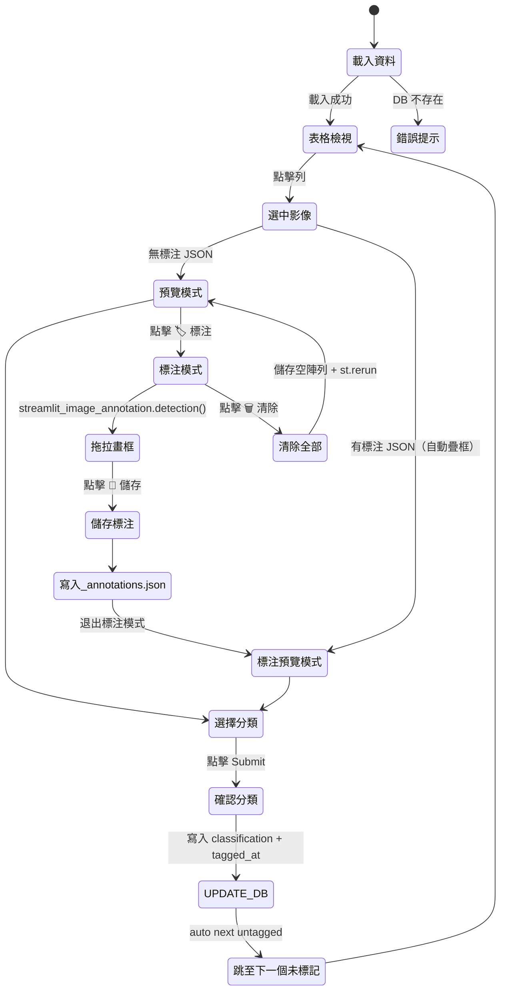

# Module 006：動物影像標記

> **開發者參考**：`scripts/module_006/README.md`
> **使用者操作指南**：`scripts/module_006/guide.html`（嵌入於 Input 頁面「📖 使用說明」）

---

## 概要

| 項目 | 值 |
|---|---|
| **plugin_id** | `module_006` |
| **版本** | 1.0.0 |
| **runner** | cv_framework |
| **標注格式** | X-AnyLabeling JSON（由 X-AnyLabeling 原生產生）|
| **設定檔** | `{CIM_LOG_DIR}/config/module_006.json` |

**用途**：動物影像資料集的雙模式標記工具
- **分類標記**：為每張影像選擇正確類別（貓/狗/大象/unknown），儲存至 SQLite
- **標注標記**：點擊 🏷 按鈕，進入 Bounding Box 標注模式，使用 X-AnyLabeling 畫框，儲存為 JSON

**特殊架構**：output 層程式碼位於 `tools/animal_tagger_output.py`（而非 `scripts/module_006/`），因此由 `tools/animal_tagger.py` 直接呼叫。

---

## Input 層（006_input.py）

```python
render_input() → {
    "filter": str,      # "ALL" | "貓" | "狗" | "大象"
    "db_path": str,     # 預設 testData/animal/animals.db
    "image_dir": str    # 預設 testData/animal/
}
```

UI 含可展開的「進階：路徑設定」，允許覆蓋預設路徑。

---

## Process 層（006_process.py）

邏輯極簡：僅驗證 `db_path` 是否存在。

```python
execute_logic(params) → params（原封不動）| {**params, "error": "db_not_found"}
```

---

## Output 層（tools/animal_tagger_output.py）

此為最複雜的 output 層，直接實作完整互動 UI。

### 資料庫結構（animals.db）

```sql
-- images 資料表（由外部建立）
id, filename, file_type, image_time, true_label, classification, tagged_at
```

### 主要 UI 元件

1. **DataFrame 表格**（`on_select="rerun"`）：點擊任一列即選中，切換影像預覽
2. **統計列**：`共 N 筆 ｜ 已分類 M 筆 ｜ 已標注 K 筆`
3. **標記列**（4 欄）：
   - 欄 1：選中影像資訊 + 目前分類
   - 欄 2：分類下拉選單（貓/狗/大象/unknown）
   - 欄 3：Submit 按鈕 → `UPDATE images SET classification=? WHERE id=?`，自動跳至下一個未標記項目
   - 欄 4：🏷 標注 / 🏷 標注中（切換標注模式）
4. **標注模式**（`_render_annotation_panel`）：
   - `streamlit_image_annotation.detection()` 畫布
   - 顯示已存標注框（從 `_annotations.json` 讀取）
   - 💾 儲存標注 → 寫入 `{stem}_annotations.json`
   - 🗑 清除全部 → 儲存空陣列並退出標注模式
5. **預覽模式**：若影像有已儲存標注，自動以 OpenCV 繪製彩色框後顯示

### 標注色彩對應

```python
colors = [(255, 80, 80), (80, 255, 80), (80, 80, 255), (255, 200, 0)]
# 對應：貓（紅）、狗（綠）、大象（藍）、unknown（黃）
```

---

## 設定系統（_config.py）

設定檔路徑：`{CIM_LOG_DIR}/config/module_006.json`

```json
{
  "annotation_labels": ["眼睛", "鼻子", "嘴巴"]
}
```

函式：
- `get_annotation_labels() → list[str]`
- `set_annotation_labels(labels: list[str]) → None`

---

## 狀態圖


