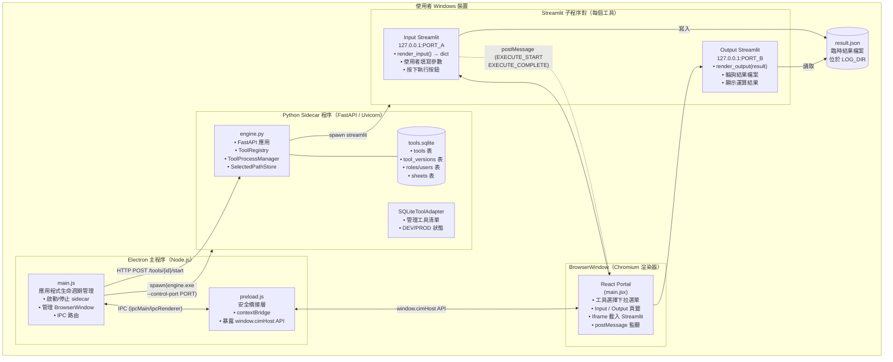
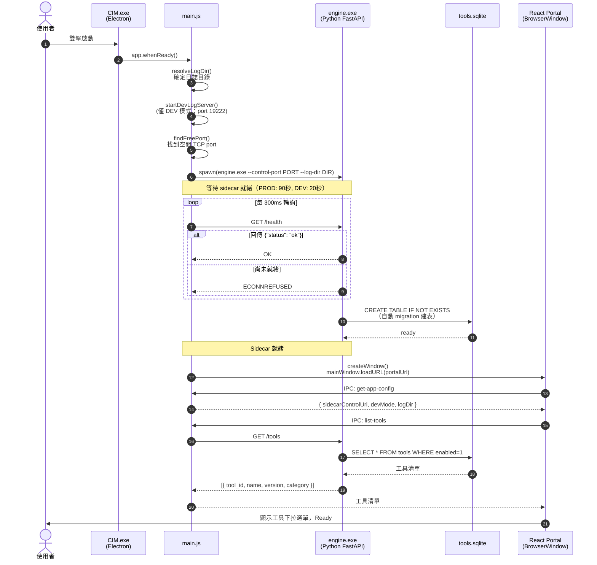
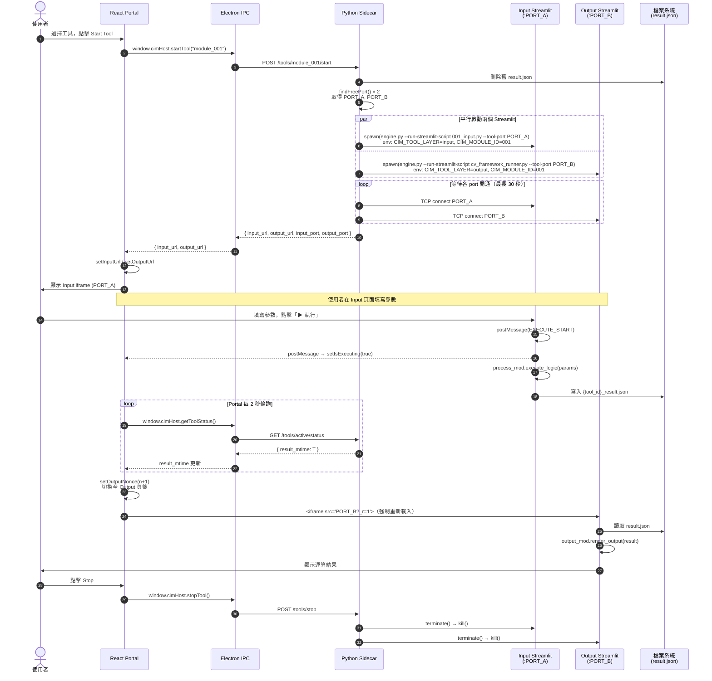
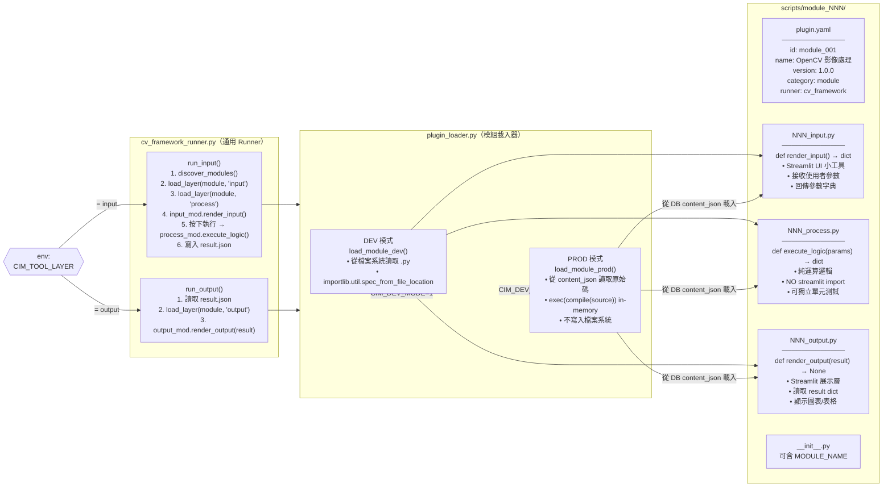
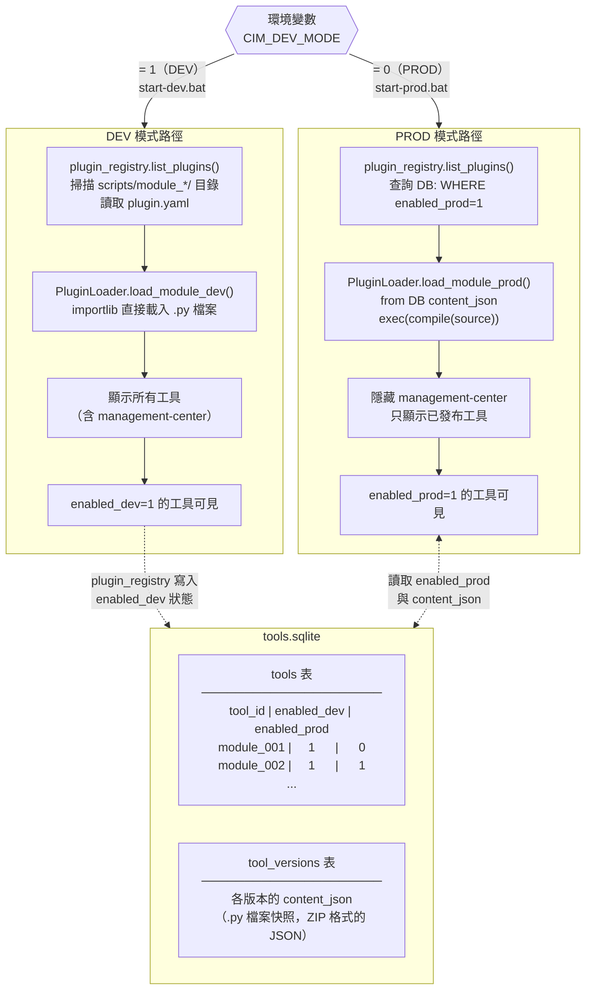
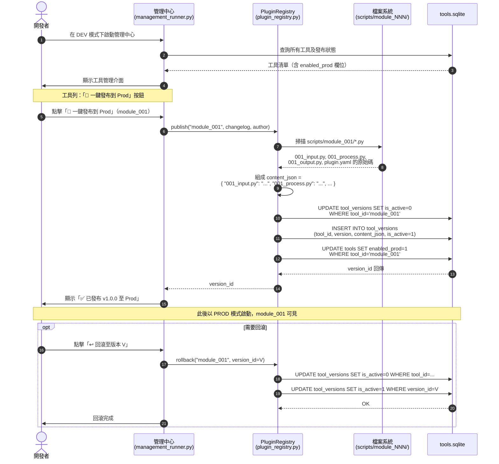
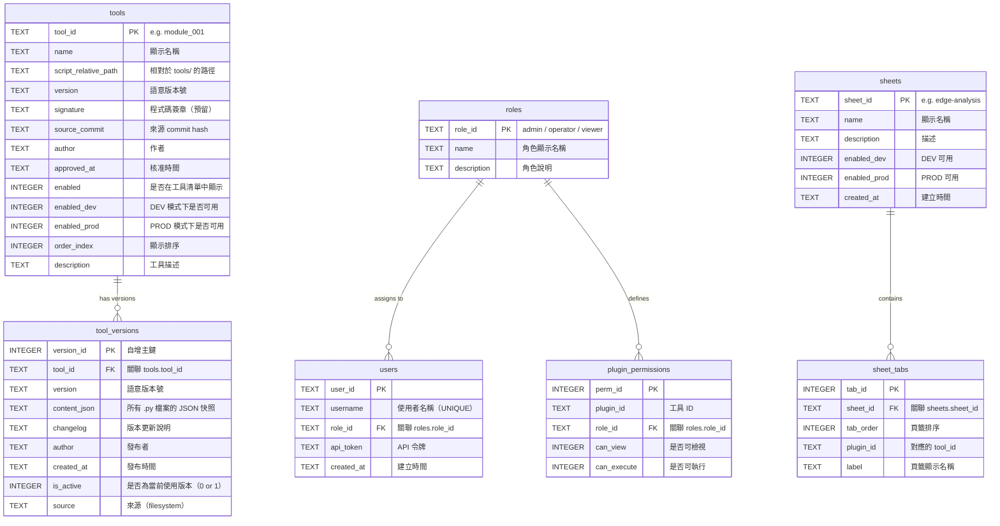
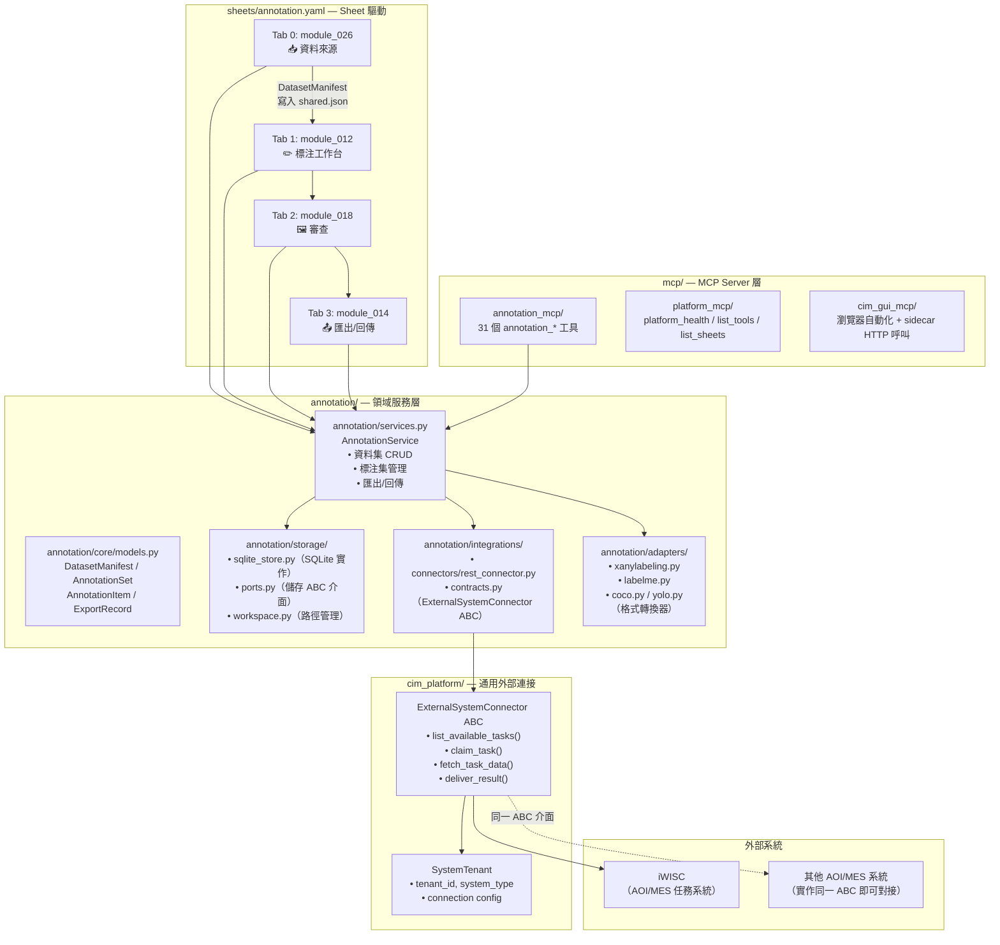
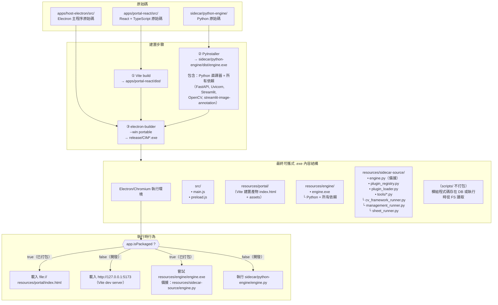
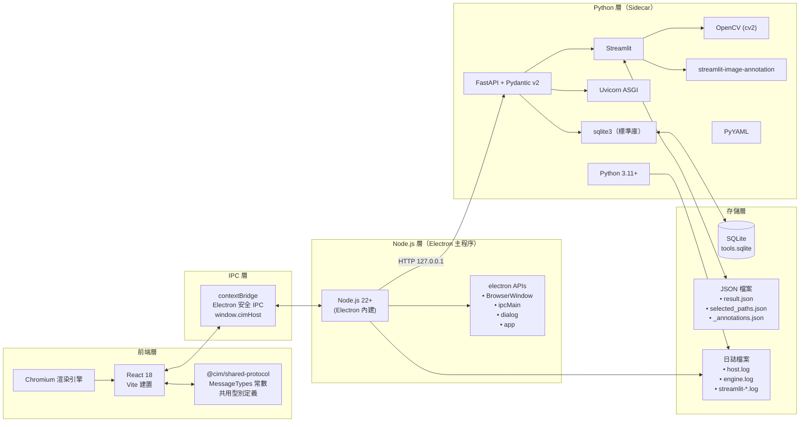

# CIM Hybrid Edge Platform — 系統架構文件

> **目的**：本文件以 NotebookLM 為目標受眾撰寫，內容自給自足，讀者無需閱讀原始碼即可完整理解系統設計、元件職責與關鍵決策。文件包含大量 Mermaid 圖表，供 NotebookLM 生成問答與解說。

> **⚠️ 結構現況（2026-05 架構重構後）**：共用碼已集中到 **`core/`**、Labeling 已收成 **`plugins/labeling/`**。
> 本文件部分章節（目錄結構附錄、標注資料流、元件圖）仍沿用**重構前路徑**，這些**已不存在**，請以下列現況對照為準（權威現況：[`../README.md`](../README.md)「專案結構」+ [`shared-components.md`](shared-components.md)）：
> `annotation/` → `plugins/labeling/domain/`；`cim_platform/` → `core/integrations/`；`mcp/annotation_mcp/` → `plugins/labeling/mcp/`（啟動 `python -m plugins.labeling.mcp.server`）；頂層 `scripts/sheets/` → 已移除（sheet 改放 `sheets/` 或 `plugins/*/sheets/`）。
> 新增工具的現況路徑：`python tools/scaffold.py`（見 CLAUDE.md / README「開發新工具」）。

---

## 目錄

1. [專案背景與目標](#1-專案背景與目標)
2. [系統概覽（C4 元件圖）](#2-系統概覽c4-元件圖)
3. [啟動序列](#3-啟動序列)
4. [工具執行流程](#4-工具執行流程)
5. [cv_framework 模組架構](#5-cv_framework-模組架構)
6. [DEV 與 PROD 模式](#6-dev-與-prod-模式)
7. [Plugin 發布流程](#7-plugin-發布流程)
8. [資料庫綱要](#8-資料庫綱要)
9. [標注資料流](#9-標注資料流)
10. [打包架構](#10-打包架構)
11. [技術堆疊](#11-技術堆疊)
12. [附錄：目錄結構](#12-附錄目錄結構)

---

## 1. 專案背景與目標

**CIM（Computer Integrated Manufacturing）Hybrid Edge Platform** 是一款執行於 Windows 桌面的邊緣裝置應用程式，專為工廠現場的電腦視覺（CV）工具管理而設計。

### 核心問題陳述

工廠邊緣裝置需要能夠：
- 在**無網路或低頻寬**環境下運作（Edge）
- 讓**非程式開發人員**（操作員）能夠直接使用 CV 演算法
- 讓**開發人員**能夠快速迭代 CV 模組，而不需要重新打包整個應用程式
- 在**正式生產**前，對 CV 模組進行版本控管與審核

### 解決方案設計哲學

| 問題 | 設計決策 | 理由 |
|------|----------|------|
| 跨語言整合（JS + Python） | Sidecar 模式 | Python 擁有最豐富的 CV 生態（OpenCV、PyTorch） |
| UI 快速迭代 | Streamlit 子程序 | 開發者熟悉 Python；無需前端技能即可製作互動 UI |
| 版本隔離 | DEV/PROD 雙軌 | 開發中的模組不影響生產環境 |
| 離線能力 | 本地 SQLite | 無需網路連線 |
| 跨平台打包 | Electron + PyInstaller | 一鍵生成 Windows 可攜式 .exe |

---

## 2. 系統概覽（C4 元件圖）

本系統由四個主要元件組成，透過 HTTP 或程序間通訊（IPC）相互協作。



### 元件職責說明

**Electron 主程序（main.js）**
- 應用程式的總指揮，負責啟動生命週期
- 找到空閒 TCP 端口後生成 Python sidecar 子程序
- 提供 IPC handlers（`start-tool`、`stop-tool`、`choose-file` 等）供 React Portal 呼叫
- 監控 sidecar 崩潰並自動重啟（3 秒後）

**Preload Script（preload.js）**
- Electron 的安全橋接層，在 `contextIsolation: true` 模式下執行
- 將 `window.cimHost` API 注入至渲染器，使 React 可以呼叫 Electron 功能，但不能直接存取 Node.js

**React Portal（main.jsx）**
- 純前端 UI，以 Vite + React 構建
- 透過 `<iframe>` 嵌入 Streamlit 的 Input 和 Output 頁面
- 監聽 `postMessage` 事件（來自 Streamlit iframe）偵測執行狀態
- 每 2 秒輪詢 sidecar 的 `/tools/active/status` 端點，偵測結果檔案更新

**Python Sidecar（engine.py）**
- FastAPI + Uvicorn 輕量 HTTP 伺服器，只監聽 `127.0.0.1`（本機迴環，無網路暴露風險）
- 管理工具的 SQLite 登錄（`ToolRegistry`）
- 生成並管理 Streamlit 子程序對（`ToolProcessManager`）

**Streamlit 工具程序**
- 每個工具啟動時建立兩個獨立的 Streamlit 程序：Input 和 Output
- 這兩個程序透過一個共享的 JSON 結果檔案交換資料

---

## 3. 啟動序列

應用程式的啟動涉及多個非同步步驟，任一環節失敗均會顯示錯誤對話框並退出。



### 啟動失敗處理

若 sidecar 在超時前未回應，Electron 會嘗試備援啟動候選（先 `engine.exe`，再 `python engine.py`），若全部失敗則顯示錯誤對話框並呼叫 `app.quit()`。

---

## 4. 工具執行流程

使用者選擇工具後，點擊「Start Tool」到最終看到結果，涉及多個程序間的協作。



### 關鍵設計決策：雙程序通訊機制

Input → Output 之間的資料傳遞採用**共享 JSON 結果檔案**，而非直接 HTTP 呼叫或 WebSocket，原因如下：

1. **程序獨立性**：Input 和 Output 是完全獨立的 Streamlit 程序，各自管理自己的 session state
2. **冪等重載**：Output 可以隨時重新載入，永遠讀到最新的結果
3. **簡單可靠**：省去程序間 RPC 的複雜度，且結果可以被外部工具直接讀取

---

## 5. cv_framework 模組架構

每個 CV 模組遵循嚴格的三層架構，由 `cv_framework_runner.py` 作為通用 Runner 驅動。



### 三層分離的設計理由

```mermaid
flowchart TD
    subgraph 為什麼分層？
        A["Input 層\n（Streamlit UI）\n✓ 可獨立修改 UI\n✗ 不含運算邏輯"]
        B["Process 層\n（純 Python 運算）\n✓ 可獨立單元測試\n✓ 無 Streamlit 依賴\n✓ 可在 CI 中執行"]
        C["Output 層\n（Streamlit 展示）\n✓ 可獨立修改展示\n✗ 不含運算邏輯"]
    end
    A -->|params dict| B
    B -->|result dict| C
```

**關鍵約束**：`process.py` 中**禁止 import streamlit**，確保運算邏輯可以在無 UI 環境下被自動化測試。

### 現有模組清單

| 模組 ID | 名稱 | 說明 |
|---------|------|------|
| `module_001` | OpenCV 影像處理 | 灰階、模糊、邊緣偵測、二值化等 11 種操作 |
| `module_002` | 影像資訊讀取 | 讀取影像基本資訊（尺寸、色彩空間等）—— Portal 隱藏，Sheet 專用 |
| `module_003` | 不規則邊框產生器 | 生成不規則形狀的邊框 |
| `module_004` | 邊緣完整度偵測 | 偵測物件邊緣的完整性 |
| `module_005` | 邊緣記錄查詢 | 查詢歷史邊緣偵測記錄 |
| `module_006` | 動物影像標記 | 整合標注面板的動物分類工具 |
| `module_012` | 標注工作台 | X-AnyLabeling/LabelMe/ISAT 標注作業管理（🐜 影像標註 Tab 2） |
| `module_013` | Update | 更新/同步標注結果至資料集 |
| `module_014` | 匯出/回傳 | 多格式匯出（COCO/YOLO/Pascal VOC/ImageFolder/CSV）+ iWISC deliver_result（🐜 影像標註 Tab 4） |
| `module_015` | Export Dashboard | 歷史匯出記錄查詢 |
| `module_016` | AI Pre-labeling | YOLO 預標注，整合至標注工作台 expander |
| `module_017` | 統計/分析 | 標注統計分析 |
| `module_018` | 審查 Gallery | Grid 縮圖 + BBox overlay 快速審查（🐜 影像標註 Tab 3） |
| `module_021` | 管理中心擴充 | 管理中心附屬功能 |
| `module_026` | 資料來源 | 統一資料來源入口，整合本地資料夾與外部任務系統（🐜 影像標註 Tab 1） |

#### 廢棄模組（`enabled: false`，程式碼保留但不載入）

| 模組 ID | 名稱 | 廢棄原因 |
|---------|------|---------|
| `module_010` [廢棄] | Data Feeder | 整合至 module_026 本地資料夾模式 |
| `module_019` [廢棄] | Data Downloader | 整合至 module_026 外部任務系統模式 |
| `module_022` [廢棄] | 標註權限管理 | 移至管理中心（待完整實作） |
| `module_023` [廢棄] | 標註任務 | 整合至 module_026 外部任務系統模式 |
| `module_024` [廢棄] | 標注工作台（iWISC 版） | 整合至 module_012 通用版 |
| `module_025` [廢棄] | 完成報表 | 整合至 module_014 匯出/回傳 |

---

## 6. DEV 與 PROD 模式

DEV/PROD 雙軌機制是本平台最核心的治理設計，控制模組程式碼的來源。



### DEV vs PROD 行為對照表

| 面向 | DEV 模式（CIM_DEV_MODE=1） | PROD 模式（CIM_DEV_MODE=0） |
|------|--------------------------|---------------------------|
| 程式碼來源 | 磁碟上的 `.py` 檔案 | DB 中的 `content_json` 快照 |
| 工具可見性 | `enabled_dev=1` 的所有工具 | 僅 `enabled_prod=1` 的工具 |
| 管理中心 | 顯示（用於發布） | 隱藏 |
| 模組修改 | 即時生效（無需重啟） | 必須重新發布才能更新 |
| 程式碼載入 | `importlib.util` 從檔案載入 | `exec(compile(source))` 記憶體執行 |
| 啟動腳本 | `start-dev.bat` | `start-prod.bat` |

---

## 7. Plugin 發布流程

當開發者想要將 DEV 環境的模組部署到 PROD，需要透過「管理中心」執行發布操作。



### MAX Migration 保護機制

發布流程有一個關鍵保護：從舊表（`plugins`）遷移至新表（`tools`）時，使用 `MAX()` 函數確保已啟用的狀態不會被降級：

```sql
UPDATE tools SET
    enabled_dev  = MAX(enabled_dev,  COALESCE(..., 0)),
    enabled_prod = MAX(enabled_prod, COALESCE(..., 0))
WHERE tool_id LIKE 'module_%'
```

這保證了資料庫遷移操作具有冪等性（執行多次結果相同）且永不降級（只升不降）。

---

## 8. 資料庫綱要

系統使用單一 SQLite 檔案（`LOG_DIR/data/tools.sqlite`），由 engine.py 和 plugin_registry.py 共同管理。



### 工具狀態欄位說明

`tools` 表有三個控制可見性的欄位，容易混淆，特別說明：

| 欄位 | 含義 | 典型情境 |
|------|------|---------|
| `enabled` | 是否出現在工具清單（全局開關） | 設為 0 = 退役工具，不再顯示 |
| `enabled_dev` | DEV 模式下是否可選用 | 開發中的工具（預設 1） |
| `enabled_prod` | PROD 模式下是否可選用 | 只有經過 publish 才設為 1 |

---

## 9. 標注資料流

### 9.1 Annotation 領域架構（annotation/ package）

`sidecar/python-engine/annotation/` 是標注資料語意的**唯一擁有者**，GUI 工具、MCP 工具、匯出功能都透過此 package 存取標注資料。



### 9.2 統一 Annotation Sheet 資料流

`🐜 影像標註` sheet 採用 4-tab 線性工作流程，tab 之間透過 `shared.json` 傳遞狀態：

```
shared.json（{CIM_LOG_DIR}/config/）
  ├─ last_manifest_id    ← module_026 寫入
  ├─ source_type         ← "local" | "iwsc"
  ├─ iwsc_tenant_id      ← （iWISC 模式）
  └─ iwsc_task_id        ← （iWISC 模式）
```

**資料流向：**

```
module_026（資料來源）
  ├─ 本地模式：掃描本地資料夾 → 建立 DatasetManifest → 寫入 shared.json
  └─ iWISC 模式：認領任務 → 下載 ZIP → 解壓影像 → 儲存 original_annotation_json

module_012（標注工作台）
  ├─ 讀 shared.json → manifest_id
  ├─ 開啟 X-AnyLabeling/LabelMe 進行標注
  └─ 寫入 {image_dir}/{stem}.json（標注 JSON）

module_018（審查 Gallery）
  ├─ 讀 manifest → 掃描標注 JSON
  └─ Grid 縮圖 + BBox overlay → 標記需重工項目

module_014（匯出/回傳）
  ├─ 本地匯出：COCO / YOLO / Pascal VOC / ImageFolder / CSV
  └─ iWISC 回傳：POST deliver_result → 外部系統
```

### 9.3 舊格式相容說明

`module_006`（動物影像標記）使用早期的 `{stem}_annotations.json` 格式（分類標籤，非物件偵測），屬於獨立的工具，不屬於 `sheet-annotation` 工作流。新的 annotation 工作流使用 X-AnyLabeling 原生 JSON 格式（同目錄同名 `.json`）。

---

## 10. 打包架構

最終產品是一個 Windows 可攜式 `.exe`，不需要安裝 Node.js 或 Python。



### 打包策略決策

**為什麼同時包含 engine.exe 和 sidecar-source？**

這提供了雙重保障：
1. **主路徑**（`engine.exe`）：PyInstaller 打包的獨立執行檔，包含所有 Python 依賴，無需安裝 Python
2. **備援路徑**（`sidecar-source/engine.py`）：若 exe 損毀或被防毒軟體阻擋，只要機器上有 Python 環境即可使用

**為什麼 scripts/ 模組目錄不打包？**

CV 模組（`scripts/module_NNN/`）在 PROD 模式下從 DB 的 `content_json` 載入，因此**不需要**在可攜式 exe 中包含這些原始碼。這同時帶來安全好處：程式碼快照在 DB 中受到版本控管，無法被終端使用者直接修改。

---

## 11. 技術堆疊

### 技術選型總表

| 層次 | 技術 | 版本 | 選擇理由 |
|------|------|------|---------|
| 桌面框架 | Electron | 39.8.9 | 業界標準的跨平台桌面方案；支援 Chromium 渲染器 |
| 前端框架 | React | 18+ | 元件化 UI；生態豐富 |
| 前端建置 | Vite | 最新 | 開發熱重載快速；打包輸出乾淨 |
| 前端語言 | TypeScript + JSX | - | 型別安全；shared-protocol 套件 |
| API 伺服器 | FastAPI | 最新 | Python 原生 async；自動 OpenAPI 文件 |
| WSGI 伺服器 | Uvicorn | 最新 | 輕量；與 FastAPI 官方搭配 |
| 工具 UI | Streamlit | 最新 | 讓 Python 開發者不需前端知識即可製作互動 UI |
| CV 函式庫 | OpenCV (cv2) | 最新 | 工業 CV 標準；功能齊全 |
| 標注元件 | streamlit-image-annotation | 最新 | 提供 detection() bbox 標注元件 |
| 資料存儲 | SQLite | 內建 | 無伺服器；單檔案；適合邊緣裝置 |
| 資料驗證 | Pydantic | v2 | FastAPI 整合；型別安全的請求/回應模型 |
| Python 打包 | PyInstaller | 最新 | 將 Python 程式打包為獨立 exe |
| Electron 打包 | electron-builder | 26+ | 支援 portable 模式（單一 exe） |
| 測試（Python） | pytest | 最新 | 標準 Python 測試框架 |
| 測試（JS） | Vitest | 4+ | Vite 整合；快速 |

### 技術架構圖



---

## 12. 附錄：目錄結構

```
nativeApp/
├── apps/
│   ├── host-electron/          # Electron 主程序
│   │   └── src/
│   │       ├── main.js         # 主程序入口
│   │       └── preload.js      # contextBridge 橋接
│   └── portal-react/           # React 前端
│       └── src/
│           └── main.jsx        # React 應用入口
├── packages/
│   └── shared-protocol/        # 共用 TypeScript 套件
│       └── (MessageTypes 等常數)
├── mcp/
│   ├── platform_mcp/           # 平台層 MCP server（health/list_tools/list_sheets）
│   ├── annotation_mcp/         # 標注領域 MCP server（31 個 annotation_* 工具）
│   └── cim_gui_mcp/            # GUI 瀏覽器自動化 MCP server
├── external-systems/
│   └── iwsc/                   # iWISC 外部任務系統（FastAPI 參考實作）
├── sidecar/
│   └── python-engine/          # Python FastAPI 後端
│       ├── engine.py            # 主程式（FastAPI + 程序管理）
│       ├── plugin_registry.py   # Plugin 版本管理
│       ├── plugin_loader.py     # DEV/PROD 模組載入器
│       ├── auth_provider.py     # 權限檢查（佔位實作）
│       ├── annotation/          # Annotation 領域服務
│       │   ├── core/models.py   # DatasetManifest、AnnotationSet 等領域模型
│       │   ├── services.py      # AnnotationService（業務邏輯）
│       │   ├── storage/         # SQLite Store + ports ABC
│       │   ├── integrations/    # ExternalSystemConnector + RestConnector
│       │   └── adapters/        # 格式轉換（X-AnyLabeling/LabelMe/COCO/YOLO）
│       ├── cim_platform/        # 通用外部連接介面（ExternalSystemConnector ABC）
│       ├── sheets/              # Sheet YAML 設定
│       │   └── annotation.yaml  # 🐜 影像標註 sheet（4 tabs：026→012→018→014）
│       ├── tools/               # 通用 Runner 腳本
│       │   ├── cv_framework_runner.py   # 三層架構通用 Runner
│       │   ├── management_runner.py     # 管理中心 Streamlit
│       │   ├── sheet_runner.py          # 頁面套件 Runner
│       │   └── ...
│       └── scripts/             # CV 模組定義
│           ├── module_001/      # OpenCV 影像處理
│           │   ├── plugin.yaml
│           │   ├── 001_input.py
│           │   ├── 001_process.py
│           │   └── 001_output.py
│           ├── module_012/      # 標注工作台（🐜 Tab 2）
│           ├── module_014/      # 匯出/回傳（🐜 Tab 4）
│           ├── module_016/      # AI Pre-labeling
│           ├── module_018/      # 審查 Gallery（🐜 Tab 3）
│           ├── module_026/      # 資料來源（🐜 Tab 1）
│           └── shared/          # 共用 UI 元件
├── docs/
│   ├── ARCHITECTURE.md          # 本文件
│   └── modules/                 # 各模組詳細文件
├── release/                     # 打包輸出目錄
├── start-dev.bat                # 開發模式啟動腳本
├── start-prod.bat               # 生產模式啟動腳本
└── package.json                 # Monorepo 根設定
```

---

## 關鍵設計模式總結

### Sidecar 模式
Python 程序作為 Electron 的「附隨程序」（Sidecar），透過 HTTP 與主程序通訊。此模式的好處是：Python 和 Node.js 完全解耦，各自可以獨立更新；Python 崩潰不影響 Electron 主視窗，反之亦然。

### 雙程序分頁模式
每個工具的 Input 和 Output 分別是獨立的 Streamlit 程序，透過 `<iframe>` 嵌入同一個 React 頁面，以「頁籤切換」的方式模擬單頁應用體驗。此模式允許 Output 在不影響 Input 狀態的情況下重新載入。

### 三層 CV 模組模式
Input → Process → Output 的三層分離，讓 CV 演算法（Process 層）可以被獨立測試，同時允許 UI（Input/Output 層）獨立演進。

### 雙軌發布模式（DEV/PROD）
模組程式碼在 DEV 環境從磁碟讀取，在 PROD 環境從資料庫快照執行，提供明確的審核閘門，確保未經驗證的程式碼不會在生產環境執行。

---

*文件最後更新：2026-05-29*
*對應代碼庫版本：CIM Hybrid Edge Platform v0.1.0*
---

## Annotation Platform 架構重點（2026-05-29 更新）

Annotation 整合設計為可重用平台元件，而非單一用途的 X-AnyLabeling 橋接。

### 核心原則

- **唯一語意擁有者**：`sidecar/python-engine/annotation/` 是標注資料語意的唯一擁有者。GUI 工具、MCP 工具、匯出功能都透過此 package 存取。
- **儲存邊界**：annotation-core 使用 SQLite-backed store 抽象，未來的任務模組可以重用相同的 dataset、annotation set、validation、review 概念。
- **Adapter 邊界**：LabelMe、X-AnyLabeling、COCO、YOLO detection 是 adapter，負責與 canonical annotation-core models 之間的格式轉換。
- **外部連接邊界**：`cim_platform/` 定義 `ExternalSystemConnector` ABC，任何 AOI/MES 系統（iWISC 或其他）只要實作此 ABC 即可與平台對接。
- **MCP 邊界**：`mcp/annotation_mcp/` 暴露 31 個 annotation_* 工具，涵蓋資料集建立、匯入、驗證、審查、匯出、runtime 偵測、X-AnyLabeling 啟動等完整工作流程。

### Sheet 驅動機制（2026-05 新增）

Sheet tab 配置由 `sheets/*.yaml` 定義，engine 啟動時自動載入，**不再 hardcode** 於 engine.py。`🐜 影像標註` sheet 的 4-tab 工作流程（026→012→018→014）由 `sheets/annotation.yaml` 完整定義。

詳見 `docs/modules/sheet-annotation_workflow.md`。
