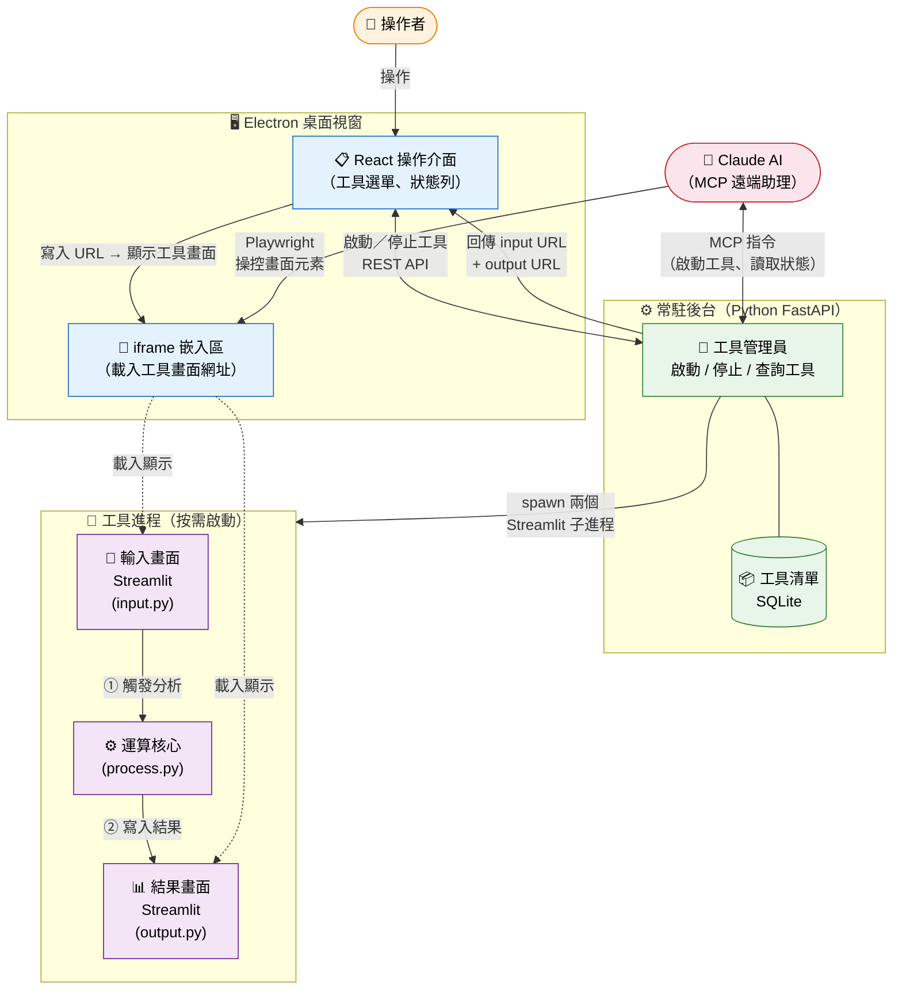
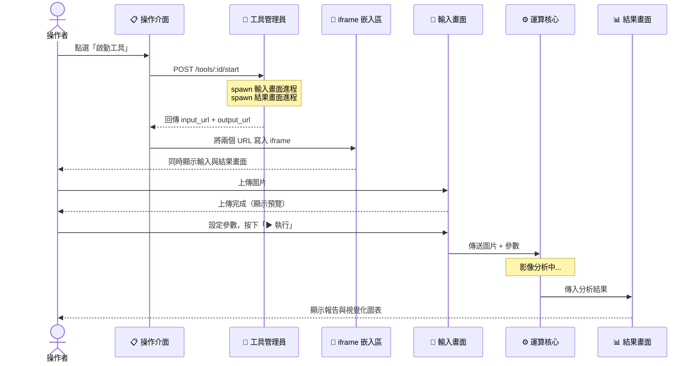

# CIM Hybrid Edge Platform — 系統圖

## 一、架構圖（各元件是什麼）

```mermaid
flowchart TB
    classDef user fill:#FFF3E0,stroke:#F57C00,color:#000
    classDef desktop fill:#E3F2FD,stroke:#1565C0,color:#000
    classDef backend fill:#E8F5E9,stroke:#2E7D32,color:#000
    classDef tool fill:#F3E5F5,stroke:#6A1B9A,color:#000
    classDef ai fill:#FCE4EC,stroke:#C62828,color:#000

    U(["👤 操作者"]):::user
    AI(["🤖 Claude AI\n（MCP 遠端助理）"]):::ai

    subgraph WIN["🖥️ Electron 桌面視窗"]
        direction TB
        UI["📋 React 操作介面\n（工具選單、狀態列）"]:::desktop
        FRAME["🔲 iframe 嵌入區\n（載入工具畫面網址）"]:::desktop
        UI -->|"寫入 URL → 顯示工具畫面"| FRAME
    end

    subgraph SVC["⚙️ 常駐後台（Python FastAPI）"]
        direction TB
        API["🧠 工具管理員\n啟動 / 停止 / 查詢工具"]:::backend
        DB[("📦 工具清單\nSQLite")]:::backend
        API --- DB
    end

    subgraph TOOLS["🔬 工具進程（按需啟動）"]
        direction LR
        IN["📝 輸入畫面\nStreamlit\n(input.py)"]:::tool
        PROC["⚙️ 運算核心\n(process.py)"]:::tool
        OUT["📊 結果畫面\nStreamlit\n(output.py)"]:::tool
        IN -->|"① 觸發分析"| PROC
        PROC -->|"② 寫入結果"| OUT
    end

    U -->|"操作"| UI
    UI <-->|"啟動／停止工具\nREST API"| API
    API -->|"spawn 兩個\nStreamlit 子進程"| TOOLS
    API -->|"回傳 input URL\n+ output URL"| UI
    FRAME -.->|"載入顯示"| IN
    FRAME -.->|"載入顯示"| OUT
    AI <-->|"MCP 指令\n（啟動工具、讀取狀態）"| API
    AI -->|"Playwright\n操控畫面元素"| FRAME
```

---

## 二、執行流程（一次分析怎麼跑）

```mermaid
sequenceDiagram
    actor 操作者
    participant UI as 📋 操作介面
    participant API as 🧠 工具管理員
    participant iframe as 🔲 iframe 嵌入區
    participant 輸入 as 📝 輸入畫面
    participant 運算 as ⚙️ 運算核心
    participant 結果 as 📊 結果畫面

    操作者->>UI: 點選「啟動工具」
    UI->>API: POST /tools/:id/start
    Note over API: spawn 輸入畫面進程<br/>spawn 結果畫面進程
    API-->>UI: 回傳 input_url + output_url
    UI->>iframe: 將兩個 URL 寫入 iframe
    iframe-->>操作者: 同時顯示輸入與結果畫面

    操作者->>輸入: 上傳圖片
    輸入-->>操作者: 上傳完成（顯示預覽）
    操作者->>輸入: 設定參數，按下「▶ 執行」

    輸入->>運算: 傳送圖片 + 參數
    Note over 運算: 影像分析中...
    運算->>結果: 傳入分析結果
    結果-->>操作者: 顯示報告與視覺化圖表
```
